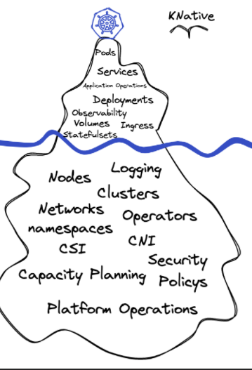

***DISCLAIMER: This IKEAlab is under development and on MVP stage. The Labs are designed to be done in group, as to enforce Togetherness and Engineering Thinking. Please, any feedback is very important for us to keep improving for future colleagues.***

## Time Plan : 

* 1 - Introduction , 09:00am
* 2 - Discussions on Engineering thinking, learning outcome , till 10:30am
* 3 - 10min break.
* 4 - Hands on Lab, till 12 noon.
* 5 - Lunch , 12noon - 01:00pm
* 6 - Lab and reflection till 02:30pm
* 7 - Break for 10mins
* 8 - Days retrospective
* 9 - Live demo, serverless in action.
* 10 - Day end by 04:00pm

# ikealab - Serverless

This lab is designed for Engineers to discuss and develop critical thinking around Serverless and it's business benefits for IKEA.

## Serverless into Business

There's a constant need to delivery Products for our Customers to try them out, thus we can fastly collect a valid feedback and keep interacting for improving the Product.

Serverless computing gives an opportunity 

## Engineering Thinking

- Understand Cloud native and cloud agonistic.
- Ingka's adaptation.
- Is GKE cloud agonistic ? 
- Is Serverless a good approach and aligned with IKEA Key Values like simplicity and cost-consciousness?
- Is serverless not suitable for some businesses cases? which ones are most common?
- Serverless is a way for low maintainability costs?
- Difference between Serverless and Managed
- how to deal with cold start time without have minimum instances?
- how to avoid "scaling up" a code mistake or so?
- What is the best available set of tools and technologies I can use for that?

## Learning Outcome

- I am able to deploy applications on Cloud Run
- I understand the benefits of serverless computing for IKEA
- I understand with some compromises, serverless can solve most business problems
- I understand that serverless is not a magic bullet that solves all issues
- I understand the decision for/against serverless needs to include more than just cost. (labour, maintenance, simplicity to run it)
- I avoid min instances for Cloud Run and improve application to decrease cold start instead.
- I understand: better (faster) code means lower costs with serverless
- I know the priorities and arguments for choosing serverless (in this order):
   - Cloud Run
   - Cloud Functions
   - App Engine flexible
   - IKEA Managed GKE
   - Deploy and manage your own Google Kubernetes Cluster (avoid)
   - managed Instance group with VM  (good to avoid)
   - Bare metal VM  (good to avoid)

## GKE, what efforts we are missing to count ? 

## serverless hands_on

Click below to start the serverless hands_on steps:

- [deploy ikealabs application on serverless GCP](./hands_on/ikealabs_steps_using_serverless_gcp.md)

