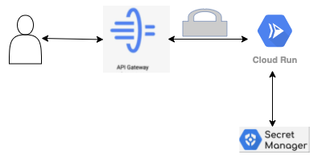

# [let's retake the last steps with a more secure approach this time]

Right now the Cloud Run app is public, anyone can call from internet even if behind the API Gateway!!


# What we will be doing in this section of the lab ?

* 1 - Create a GCP service account.
* 2 - Deploy the same cloud run with Service account.
* 3 - Deploy Cloud api gateway using that service account.





Let's start by creating a proper Service Account for our Cloud Run Instance.

## [create a Service account and assign role]

* 1 - Create Cloud Run Service account

```
gcloud iam service-accounts create sl-lab-cr-invoker-<YOUR_NAME> \
    --description="SA to be used to autheticate cloud run back end" \
    --display-name="serverless-lab-cr-invoker-<YOUR_NAME>"
```

* 2 - Grant IAM Role to Service Account

```
gcloud projects add-iam-policy-binding ingka-native-ikealabs-dev \
    --member="serviceAccount:sl-lab-cr-invoker-<YOUR_NAME>@ingka-native-ikealabs-dev.iam.gserviceaccount.com" \
    --role="roles/run.invoker"
```
**NOTE : The Service Account should be as less permissive as possible for that to work. Avoid using bigger roles like "owner" or "editor" on your GCP Projects.
Your objective will always have to be reduced as much as possible the permission on SA, so fine grain it really. 
GCP has one great role for this job, "cloud run invoker", we are using it.
It's recommended to create custom roles, if you need to, 'cherry pick' only required permissions.**

In this case we are also using Secret Manager for our api-key, so we need to grant access to that too. Again we pick the less permissive role to work:
```
gcloud projects add-iam-policy-binding ingka-native-ikealabs-dev \
    --member="serviceAccount:sl-lab-cr-invoker-<YOUR_NAME>@ingka-native-ikealabs-dev.iam.gserviceaccount.com" \
    --role="roles/secretmanager.secretAccessor"
```

## [Deploy Cloud Run again using SA and no allow auth]

* 1 - Deploy Cloud run using the same container image

```
gcloud alpha run deploy serverless-lab-secured-<YOUR_NAME> --region europe-west1 --image eu.gcr.io/ingka-native-ikealabs-dev/app-<YOUR_NAME>:1.0.0 --project ingka-native-ikealabs-dev --platform "managed" --memory 512Mi --cpu 1 --no-allow-unauthenticated --service-account sl-lab-cr-invoker-<YOUR_NAME>@ingka-native-ikealabs-dev.iam.gserviceaccount.com --max-instances=2 --update-secrets=API_KEY=API_KEY_SERVERLESSLAB-<YOUR_NAME>:latest --quiet
```

**NOTE : we have added a service account and used "no-allow-unauthenticated". 
Also we have put "max-instances", it's a good practice to limit the upper scale in serverless engines, in case something gets wrong.**

* 2 - try to access your app URL on Cloud Run

Try the secured cloud run URL in a browser, this time you would get "access forbidden" error, it won't show you the products even with api-key. Meaning, it's public protected.


## [Update the apispec.yaml to have your new APP cloud run URL]

* 1 - edit apispec.yaml and update the APP_URL

```
x-google-backend:
  address: <APP_URL_CLOUD_RUN>
```

## [deploy the API Gateway with new config to call secured cloud run]

* 1 - create new apispec.yaml with updated cloud run url

```
gcloud api-gateway api-configs create serverlesslab-apispec-config-secured-<YOUR_NAME> \
  --api=serverlesslab-apigateway-secured-<YOUR_NAME> --openapi-spec=apispec.yaml \
  --project=ingka-native-ikealabs-dev --backend-auth-service-account=sl-lab-cr-invoker-<YOUR_NAME>@ingka-native-ikealabs-dev.iam.gserviceaccount.com
```

* 2 - deploy Gateway with API config, to call secured cloud run backend

```
gcloud api-gateway gateways create serverlesslab-apigateway-secured-<YOUR_NAME> \
  --api=serverlesslab-apigateway-secured-<YOUR_NAME> --api-config=serverlesslab-apispec-config-secured-<YOUR_NAME> \
  --location=europe-west1 --project=ingka-native-ikealabs-dev
```

- TEST
  - Navigate to [API Gateway](https://console.cloud.google.com/api-gateway/api?project=ingka-native-ikealabs-dev)
  - choose your deployed gateway
  - goto "GATEWAYS" tab
  - click on the "Gateway url"
  - this will give yur the same response when you hit the direct cloud run or running your app in localhost:8080, so even the cloud run back end is secured, you are able to see response when you hit the gateway. The reason behind this is we have created the gateway with the same SA with which the cloud run had been deployed, so gateway is getting the privilage to call the secured cloud run using the SA, and dont forget SA has exacly "cloud run invoker" role.

* NOTE : From latency perspective, it better to deploy your cloud run and gateway in same region.

# [it's all DONE]

The App is now running on GCP and it's available for everyone to access that behind the API Gateway. During this lab, we did use several GCP Serverless products in a way to demonstrate the simplicity and easy maintainability 


## [BONUS: add Auth on API Gateway]: 

Secured, right ? Hmmm, let us think, are we missing something more? 

Ohh... The gateway itself is not secured, means anyone can publiclly access the gateway URL, by this they can reach our secured back end.

Google Api Gateway does support quite a few security mechanism to handle this , for example Auth0 . This can be treated as next level, not bringing in this lab scope.

However following documets will really be handy =>

a. https://cloud.google.com/api-gateway/docs/authentication-method \
b. https://cloud.google.com/api-gateway/docs/authenticating-users-auth0 \
c. https://cloud.google.com/api-gateway/docs/authenticate-service-account \
d. https://cloud.google.com/api-gateway/docs/api-access-overview 


# [NEXT STEP]
[Lets play around with more serverless products, a more realistic case study](./firestore_pubsub.md)

