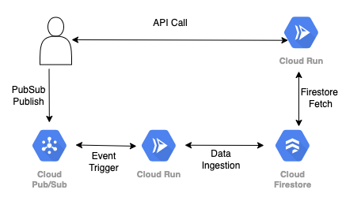

# [Lets play around with more serverless products]

Now the basic node.js app that we had deployed on cloud run is finding the product details from a static json file.
In real world, an api (micro service)will fetch data from a DB . And then obviusly we need to have a data ingestion layer which populates the data base.

One best architecture principal says that product should be decoupled from its neighbour, that gives much flexibility and good resiliency too.
Event driven approach is one approach that suffice this need.

So , your data producer (often a separate team) produces data in some topic and you have the mandate to grab those data events and ingest in your DB, your front end 
api will query this DB based on some input to show the data.

### GCP's offerings (serverless !)
1 - [Cloud PubSub](https://cloud.google.com/pubsub) as HA topic, which can handels millions of messages with gurantee of atleast once delivery, highly scalable and fully managed.

2 - [Cloud firestore](https://firebase.google.com/docs/firestore), as highly scalable no-sql document data base.


Both are much cost-effective. There are other DB offerings from GCP too for example CLoud SQL (Postgres), Cloud BigQuery or Cloud Bigtable, even Cloud Memorystore Redis as cache,
but we are using Cloud Firestore for our lab.

Firestore is created based on Firebase opensource DB. It has two flavor, native mode(more reads compared to writes) and Data store mode(more writes compared to reads).
Since it's serverless, you just have to enable its api and start using it, that's it. Google provided out of the box lib to access it in many languages.
It can scale automatically when connections increase, optimize itself automatically for faster result and repilcate data too to prevent data loss, all automatically.

Same as pubsub, you just need to enable api and create own topic, `et voilá`, you can start using it.

So, in this section of our lab, we will be using once more cloud run as new service that will fetch data from Pub/Sub and store into firestore.
we will re-write our first app that will read data from firestore, so the api will dynamically will accept some product name and will fetch its available quantity from firestore and show it as response. 

### lets Begin ! 
(we will skip security and api gateway part here because time-constraints of the lab itself, but please take note what we learned in the previous part, and always remember security is a mandatory element)


# What we will be doing in this section of the lab ?
Again, just to see what we are going to do, do not start yet ;) 

1. `01_app` which was showing response from a static JSON file, has been modified to read from a database, for our case its firestore. You can find the modified version at `02_app_firestore` folder.
2. Recreate the modified image and push it into GCR 
3. Deploy this container image on cloud run.
4. Create a Cloud PubSub topic for our events.
5. Create a new nodejs app that acts on events in PubSub and push that event data in firestore, works as our data ingestion layer, you can find this app at `03_data_ingestion_from_pubsub_to_firestore` folder.
6. Create the second app image and push it into GCR 
7. Deploy this second app image on cloud run. 
8. Create PUSH based subscription for that second app (Cloud Run) on the PubSub topic.




## [Deploying our firestore app]

1 - Firestore api is already enabled for this lab and it's in native mode. You can check the Firestore database here: https://console.cloud.google.com/firestore/data/serverlesslab_product?project=ingka-native-ikealabs-dev

2 - Let's create a docker image for our modified firestore based app. Go to `02_app_firestore` folder and from there run: 
```
docker build -t eu.gcr.io/ingka-native-ikealabs-dev/app-firestore-<YOUR_NAME>:1.0.0 .
docker push eu.gcr.io/ingka-native-ikealabs-dev/app-firestore-<YOUR_NAME>:1.0.0
```

3 - Deploy the app at cloud run. It's the same as the previous app, just reading data from firestore. \

```
gcloud alpha run deploy app-firestore-<YOUR_NAME> --region europe-west1 --image eu.gcr.io/ingka-native-ikealabs-dev/app-firestore-<YOUR_NAME>:1.0.0 --project ingka-native-ikealabs-dev --platform "managed" --memory 512Mi --cpu 1 --allow-unauthenticated --max-instances=2 --update-secrets=API_KEY=API_KEY_SERVERLESSLAB-<YOUR_NAME>:latest --quiet
```

4 - You can use postman or Curl to test your app.
```
curl -X POST -H 'Content-Type: application/json' -d '{"product_name" : "glimma", "api_key" : "<YOUR_SECRET>"}' https://<YOUR_APP_SUBDOMAIN>.run.app/api/product/availability
```

- The expected result would be that no product found, since firestore is not being populated with this data.
- Go to firestore and add one document with `product_name` and `product_availability`, type string. Add your own `product_name` to avoid conflicts with other lab mates.
- Retest the api now with `product_name` that you have just created, it should return your availability.

## [Deploy our pubsub app]
Let's try now adding a new app for data ingestion. As we discussed it will consume events from pubsub and store the new info at firestore, so it can be consumed from our current app.


5 - Go to `03_data_ingestion_from_pubsub_to_firestore` folder and create docker image and push it in GCR for data ingestion cloud run. 
```
docker build -t eu.gcr.io/ingka-native-ikealabs-dev/pubsub_to_firestore-<YOUR_NAME>:1.0.0 .
docker push eu.gcr.io/ingka-native-ikealabs-dev/pubsub_to_firestore-<YOUR_NAME>:1.0.0
```

6 - Deploy this app on cloud run. \
```
gcloud alpha run deploy pubsub-to-firestore-<YOUR_NAME> --region europe-west1 --image eu.gcr.io/ingka-native-ikealabs-dev/pubsub_to_firestore-<YOUR_NAME>:1.0.0 --project ingka-native-ikealabs-dev --platform "managed" --memory 512Mi --cpu 1 --allow-unauthenticated --max-instances=2 --update-secrets=API_KEY=API_KEY_SERVERLESSLAB-<YOUR_NAME>:latest --quiet
```
This app is newly build, it will be having a push based subscription on Pubsub , will accept events in json format and push it firestore collection, the json format will be \
```
{
  "product_name" : "SOME NAME",
  "product_availability" : "SOME VALUE"
}
```

## [Setup the pubsub topic and subscription]

7 - Let's create a topic in pubsub to push events to: 
```
gcloud pubsub topics create product_ingestion_<YOUR_NAME>
```

8 - Adding cloud run Push URL to create a push based subscription. Check here how to do it with cloud console here:
https://cloud.google.com/pubsub/docs/admin#creating_subscriptions
- Use `subs_product_ingestion_<YOUR_NAME>` for the subscription ID
- Select the topic you created on the previous step.
- Select `Push` as `Delivery type` and use your endpoint: `https://<YOUR_APP_DOMAIN>.run.app/api/product/ingestion/firestore`
- Leave rest of default options and push `CREATE`

9 - Once you have created your subscription on the previous step, let's publish one message in your pubsub topic: 
```
gcloud pubsub topics publish product_ingestion_<YOUR_NAME> --message='{"product_name":"<YOUR_PRODUCT_NAME>","product_availability":"50"}'
```
Or else, you can try from Cloud Console too.

10 - Check firestore collection, it must have your data inserted.

11 - Now try the `app_firestore` api that being deployed to fetch product_availability by sending product_name in request.
```
curl -X POST -H 'Content-Type: application/json' -d '{"product_name" : "<YOUR_PRODUCT_NAME>", "api_key" : "<YOUR_SECRET>"}' https://<YOUR_APP_SUBDOMAIN>.run.app/api/product/availability
```

## [Reflections, what we have learned so far]
1 - Lets talk about each product more, particularly DB and then PubSub

2 - apart from actual error handling or UT coverage , the pubsub to firestore app needs good modification, you can combine functionality from app-firestore. 
For instance, if a product data needs to be added in firestore, if app must check id product exists or not, etc. 

3 - Events with Cloud run, GCP EventArch 

[GCP EventArch](https://cloud.google.com/blog/topics/developers-practitioners/eventarc-unified-eventing-experience-google-cloud)


# [NEXT STEP]
[clean up and reflection](./cleanup_reflection.md)


