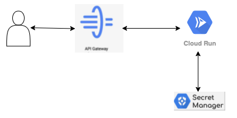
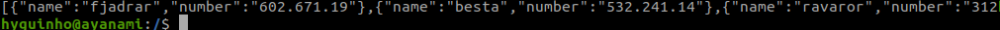
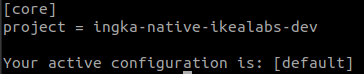

#TODO
update what you will learn and understand sessions
add reference links to the hands-on

# What you will learn

In this hands_on, you will learn how-to:

- Use gcloud cmd and console to interact with your GCP Project
- Convert a nodejs app to a container and push that to GCR 
- Deploy and test a Cloud Run Service (without security, unauthenticated call) using the container image you created (not good, because it's public available without any proctection like LB, Api gateway or auth)
- Learn a proper way to store a Secret using Secret Manager
- Understand Apispec
- Deploy API Gateway to project and test.
- Define API Gateway IAM and Roles on GCP (less permissive and security from beginning)
- Deploy new cloud run with security this time, attach SA, test, should not be accesible publicly.
- Update apispec and deploy API gateway to call secured cloud run back end.
- Test if App is working properly behind the API Gateway securely.
- As next step we will use Cloud Firestore and Pubsub to have more real product, where data beeningested via pubsub to firestore and your app get data corresponds to your input from firestore.
- Clean up everything

# Understanding what you will do 


# What we will be doing in this section of the lab ?
Just to know which is the plan, do not start yet ;) 

* 1 - We have already a nodejs app at [01_app](./01_app) folder to play with.
* 2 - Use a Dockerfile to create the image.
* 3 - Push the image to GCP container registry.
* 4 - Create a secret manager entry in GCP to hold API KEY as secret
* 5 - Deploy a cloud run service.
* 6 - Deploy Cloud api gateway, we will be using the sample apispec mentioned below.





*References for further reading:*

* [serverless computing](https://en.wikipedia.org/wiki/Serverless_computing)  

* [Cloud Run documentation](https://cloud.google.com/run) 

* [Secret Manager overview](https://cloud.google.com/secret-manager/docs/overview#secret_manager)

# Requirements

The following requirements must be done before starting the hands_on:

* 1 - Install gcloud SDK
* 2 - Install Docker
* 3 - Install nodejs
* 4 - Must have Github Cloud access and in ingka-group-digital org, if you dont have, ask for it, it's [self-service](https://portal.dev.ingka.com/get-access), and if you have any issue, reach out to engineering-services-support slack channel
* 5 - Must have GCP access, if not reach out cloud_support slack channel

# Steps for deploying the IKEAlabs application on GCP  
  
---  
  
## [clone the lab repository]  

* 1 - Open a Terminal or favourite development tool and clone this repo

```
git clone git@github.com:ingka-group-digital/native-clouders-ikealabs.git
```

* 2 - cd into the hands_on directory

```
cd labs/lab_serverless/hands_on
```

## [run the app locally]  

* 1 - Run the node.js application locally 

```
cd 01_app
npm install
node index.js
```

* 2 - curl localhost and list the IKEA Products

```
curl localhost:8080/api/products
```

(Example Output)  



## [containerize the application using docker]

*Replace <YOUR_NAME> tag for your actual surname when required*  


* 1 - Take a look to the app Dockerfile

```
# Stage 1
FROM node:16-alpine3.14 as builder

WORKDIR /home/node
ADD . .

RUN yarn install

# Stage 2
FROM node:16-alpine3.14

WORKDIR /home/node
COPY --chown=node:node --from=builder /home/node .

USER node

ENV HOST 0.0.0.0

EXPOSE 8080

CMD ["yarn", "start"]
```

* 2 - build the app container image
```
docker build -t eu.gcr.io/ingka-native-ikealabs-dev/app-<YOUR_NAME>:1.0.0 .
```

* 3 - run the container image locally (remember to stop your node app before this step, or it won't work as the port would be already in use)
```
docker run -p8080:8080 eu.gcr.io/ingka-native-ikealabs-dev/app-<YOUR_NAME>:1.0.0
```

* 4 - access the app container 
```
curl http://localhost:8080/api/products
```

* 5 - stop the running using the container ID visible with "docker ps"
```
docker ps
docker stop "CONTAINER ID"
```

*References for further reading:*  

* [docker develop doc](https://docs.docker.com/develop/)
* [dockerfile multistage build](https://docs.docker.com/develop/develop-images/multistage-build/)


## [Use gcloud cmd and console to interact with your GCP Project]

* 1 - connect to GCP ikealabs Project

```
gcloud config set project ingka-native-ikealabs-dev
```

* 2 - confirm gcloud is using right Project

```
gcloud config list project
```

(Example Output)  




*References for further reading:*  

* [gcloud_config_set](https://cloud.google.com/sdk/gcloud/reference/config/set)  


## [create app key on SECRET MANAGER]

***IT'S A BIG MISTAKE TO PUSH SENSITIVE INFORMATION TO GIT***

*Pushing sensitive information to GIT it's still a very common mistake made by IKEA Engineers. Instead, it's better to use a proper secret management tool, as GCP Secret Manager, to ensure your sensitive information is safely stored.*

* 1 - Create the App Secret on GCP Secret Manager

*Replace <YOUR_NAME> tag for your actual surname when required"*  

```
gcloud secrets create API_KEY_SERVERLESSLAB-<YOUR_NAME> \
    --replication-policy="automatic"
```

* 2 - Add version (value) to the Secret key

```
echo -n "put your secret key value" | \
    gcloud secrets versions add API_KEY_SERVERLESSLAB-<YOUR_NAME> --data-file=-
```

- NOTE : 

Its a better way that we always think about security, the idea of secret manager is to hide the secret key from our eyes. \
So, rather passing your secret value directly in the command, you can put this in a flat file and use that file , like this : \
```
gcloud secrets versions add API_KEY_SERVERLESSLAB-<YOUR_NAME> --data-file="/path/to/file.txt"
```

You can combine both steps in one go also : 
```
gcloud secrets create API_KEY_SERVERLESSLAB-<YOUR_NAME> --data-file="/path/to/file.txt"
```

*Delete the file and of course dont push that one to GIT! :)*

* 3 - list the secrets on secret manager and find yours

```
gcloud secrets list
```

## [create a cloud run service using the app container]

* 1 - push the nodejs app container to GCR
```
docker push eu.gcr.io/ingka-native-ikealabs-dev/app-<YOUR_NAME>:1.0.0
```

`If you have permission related issues, try 'gcloud auth configure-docker' to grant docker on gcloud.`

* 2 - deploy first Cloud Run service using the container
```
gcloud alpha run deploy serverless-lab-<YOUR_NAME> --region europe-west1 --image eu.gcr.io/ingka-native-ikealabs-dev/app-<YOUR_NAME>:1.0.0 --project ingka-native-ikealabs-dev --platform "managed" --memory 512Mi --cpu 1 --allow-unauthenticated --update-secrets=API_KEY=API_KEY_SERVERLESSLAB-<YOUR_NAME>:latest --quiet
```

* 3 - Go to GCP Console and check if the Service URL is available

* 4 - Check if you can access the app and list the products using the api_key param
```
curl https://<YOUR_APP_SUBDOMAIN>.run.app/api/products?api-key=<YOUR_SECRET>
```

*References for further reading:*  

* [gcloud command for cloud run deployment](https://cloud.google.com/sdk/gcloud/reference/run/deploy)


## [deploy the GCP API Gateway]

It's important to protect your API and to avoid that to be directly exposed to the Internet. There are different GCP Services which can be used for that, like [Google Load Balancing](https://cloud.google.com/load-balancing/docs) and [API Gateway](https://cloud.google.com/api-gateway).

The GCP API Gateway is a fully managed serverless gateway which provides protection for our Cloud Run API. The API Gateway offers services around Security, Authentication and Observability without a high maintainability requirement.

The API Gateway uses [OpenAPI (swagger)](https://swagger.io/specification/) specification.

* 1 - Create API apispec.yaml for the API Gateway

 *Replace <APP_URL_CLOUD_RUN> tag for your actual surname when required"*  

```
# apispec.yaml
swagger: '2.0'
info:
  title: serverless_lab cloud run as backend
  description: Cloud API gateway for node app on cloud run
  version: 1.0.0
schemes:
- https
produces:
- application/json
x-google-backend:
  address: <APP_URL_CLOUD_RUN>
paths:
  /assets/{asset}:
    get:
      parameters:
        - in: path
          name: asset
          type: string
          required: true
          description: Name of the asset.
      summary: Assets
      operationId: getAsset
      responses:
        '200':
          description: A successful response
          schema:
            type: string
  /:
    get:
      summary: welcome to IKEA Labs!
      operationId: welcome
      responses:
        '200':
          description: A successful response
          schema:
            type: string
  /api/products:
    get:
      summary: api call
      operationId: api_call
      responses:
        '200':
          description: A successful response
          schema:
            type: string
            
```

*References for further reading:*  

* [swagger specification] https://swagger.io/specification/v2/


## [Deploy API Gateway]

* 1 - Create the api config

```
gcloud api-gateway api-configs create serverlesslab-apispec-config-<YOUR_NAME> \
  --api=serverlesslab-apigateway-<YOUR_NAME> --openapi-spec=apispec.yaml \
  --project=ingka-native-ikealabs-dev
```

* 2 - Deploy Gateway with API config

```
gcloud api-gateway gateways create serverlesslab-apigateway-<YOUR_NAME> \
  --api=serverlesslab-apigateway-<YOUR_NAME> --api-config=serverlesslab-apispec-config-<YOUR_NAME> \
  --location=europe-west1 --project=ingka-native-ikealabs-dev
```

* [gcloud for api gateway for cloud run as backend] https://cloud.google.com/api-gateway/docs/get-started-cloud-run

- TEST with Gateway

  - Navigate to [API Gateway](https://console.cloud.google.com/api-gateway/api?project=ingka-native-ikealabs-dev)
  - choose your deployed gateway
  - goto "GATEWAYS" tab
  - click on the "Gateway url" , this will give yur the same response when you hit the direct cloud run or running your app in localhost:8080

```
curl https://<YOUR_GRATEWAY_SUBDOMAIN>.gateway.dev/api/products?api-key=<YOUR_SECRET>
```

## take a Pause, lets summerize and think about what we have learnt so far:

* 1 - We have dockerize our nodejs app
* 2 - Managed our app secrets properly
* 3 - Pushed to GCR and deployed on a cloud run.
* 4 - Created a apispec.yaml with our API specification.
* 5 - Deployed an API gateway with that apispec.yaml
* 6 - Tested the gateway and gotten same response even hitting the gateway URL

Right now, the app is running on serverless engine (cloud run) as backend of a gateway which is also serverless. This simple environment also means a low maintainability costs.


# [NEXT STEP]
 [Is it enough secured ? ](./cloud_run_with_security.md)